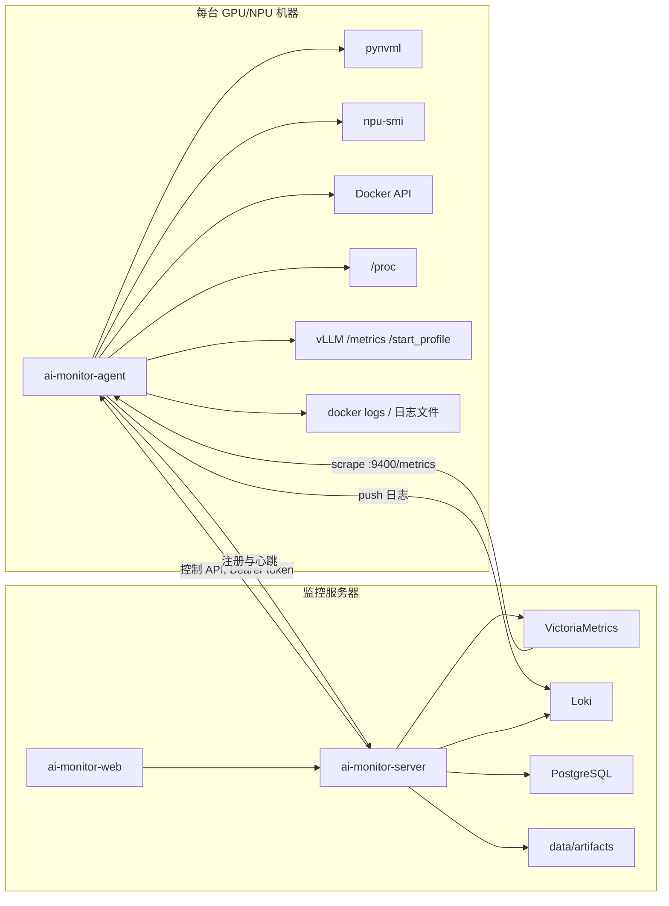

# AI Monitor 设计文档

日期：2026-09-04
状态：待用户审阅

## 1. 目标

为企业内网中几十台裸机/虚拟机提供长期（6 个月）的加速卡与推理服务监测，包括：

- NVIDIA GPU 与 Ascend NPU 的使用指标（利用率、显存、温度、功耗、健康状态、卡上进程）。
- 每台机器上 vLLM 服务的运行状态、推理指标、进程信息、日志。
- 面向调试的按需采集：vLLM torch profiler trace、py-spy、nsys、msprof。
- 企业能力：登录与角色、告警与通知、长期利用率报表、控制操作审计。

非目标（本期不做）：Kubernetes 部署、LDAP/OIDC 对接、千台规模的集群版存储、vLLM 以外推理框架的专用面板。

## 2. 已确认的决策

| 决策项 | 结论 |
| --- | --- |
| 存储底座 | VictoriaMetrics 单机版存时序，Loki 存日志，PostgreSQL 存元数据 |
| 采集与展示 | 自研 Agent、自研 FastAPI 后端、自研 React 前端 |
| 数据流 | 指标 Pull（VM scrape Agent）、日志 Push（Agent → Loki）、控制直连（server → Agent HTTP API） |
| 部署环境 | 裸机/虚拟机；Agent 以 Docker 镜像或 systemd unit 安装；服务端 docker-compose |
| vLLM 运行方式 | Docker 容器与 nohup/tmux 手动启动两种都要支持 |
| 规模 | 几十台机器，指标保留 6 个月 |
| 语言 | Agent 与后端 Python 3.11+；前端 React + TypeScript + Vite + Ant Design + ECharts |

## 3. 总体架构



前端只与 server 通信，不直连 VM/Loki。

## 4. 仓库结构

```
ai_monitor/
  agent/          # ai-monitor-agent，Python 包 + Dockerfile + systemd unit
  server/         # ai-monitor-server，FastAPI + SQLAlchemy + Alembic
  web/            # ai-monitor-web，React + TS + Vite
  deploy/         # docker-compose.yml、VM/Loki 配置、file_sd 目录、安装脚本
  docs/           # 设计文档、实施计划
```

## 5. 组件设计

### 5.1 Agent（`agent/`）

单进程，异步（asyncio），一台机器一个实例。默认监听 `0.0.0.0:9400`，可配置绑定 IP。

配置文件 `agent.yaml`：

```yaml
server_url: http://monitor.internal:8000
agent_token: <server 生成>
loki_url: http://monitor.internal:3100
listen: 0.0.0.0:9400
scrape_interval_seconds: 15
services:              # 可选：手动登记 nohup/tmux 启动的 vLLM
  - name: qwen-72b
    port: 8001
    log_path: /var/log/vllm/qwen-72b.log
    profiler_dir: /data/vllm_profile/qwen-72b
artifacts_dir: /var/lib/ai-monitor-agent/artifacts
```

子模块与职责：

- `collectors/nvidia.py`：pynvml。产出每卡 `accel_*` 指标与卡上进程列表。pynvml 导入失败或无设备时禁用。
- `collectors/ascend.py`：定时执行 `npu-smi info` 与 `npu-smi info -t usages -i <id>` 等命令并解析文本，产出同一组 `accel_*` 指标。命令不存在时禁用。解析器针对固定样本做单元测试。
- `collectors/host.py`：psutil 采集 CPU、内存、磁盘、网络。
- `discovery/docker.py`：通过 Docker socket 列出容器，命令行或镜像名含 `vllm` 的视为 vLLM 服务；从端口映射推断服务端口。
- `discovery/process.py`：扫描 `/proc`，命令行含 `vllm` 且在 `services` 中未登记的进程，尝试从监听端口推断服务端口。
- `discovery/registry.py`：合并 Docker 发现、进程发现、手动登记三类来源，生成服务列表（`name, source, pid, container_id, port, log_source, profiler_dir`），去重后上报 server。
- `vllm/metrics_proxy.py`：对每个服务抓取 `http://127.0.0.1:{port}/metrics`，附加 `host`、`service` 标签，与 `accel_*`、`host_*` 一起在 `/metrics` 暴露。
- `vllm/process_info.py`：读取 `/proc/{pid}` 的 cmdline、environ（过滤含 `KEY`、`TOKEN`、`SECRET` 的变量）、cwd、启动时间；调用 `GET /v1/models` 与 `GET /version` 获取模型与 vLLM 版本。
- `logs/tailer.py`：Docker 服务用 `docker logs --follow`，文件服务用带 inode 检测的 tail；推送 Loki，流标签 `{host, service, source}`。偏移量记录到本地状态文件；Loki 不可达时内存缓冲上限 10000 行，满后丢弃最旧。
- `control/api.py`：FastAPI，校验 `Authorization: Bearer <agent_token>`。接口：
  - `POST /control/profile/start|stop {service}`：转发到 vLLM `/start_profile`、`/stop_profile`；stop 等待完成不设短超时；完成后扫描 `profiler_dir` 新增文件并登记为产物。
  - `POST /control/pyspy {service, mode: dump|record, duration}`：对 vLLM 主进程执行 `py-spy dump` 或 `py-spy record -o svg`。
  - `POST /control/nsys {service, duration}`、`POST /control/msprof {service, duration}`：按硬件类型可用，执行采样并登记产物。
  - `GET /control/tasks/{id}`：任务状态。
  - `GET /control/artifacts/{id}`：流式下载产物。
  - `GET /control/process/{service}`：进程快照。
  控制任务在后台执行，状态 `pending/running/succeeded/failed`。
- `heartbeat.py`：每 30s `POST {server_url}/api/agents/heartbeat`，携带 host、agent 版本、硬件类型与数量、服务列表。首次调用即为注册。

依赖缺失策略：任何采集器初始化失败只记录一次警告，不影响其他采集器。

### 5.2 Server（`server/`）

FastAPI + SQLAlchemy 2 + Alembic + PostgreSQL。APScheduler 用于告警求值与报表预聚合。

API 分组：

- `/api/auth`：登录、刷新、当前用户。
- `/api/agents`：心跳接收、机器列表与详情、生成 Agent token、Agent 版本信息。心跳同时更新 `deploy/file_sd/agents.json`，供 VM scrape。
- `/api/services`：vLLM 服务列表与详情（合并心跳上报的注册信息与 VM 中的最新指标）。
- `/api/metrics/query`、`/api/metrics/query_range`：受限 PromQL 代理到 VM。允许的表达式由后端模板生成，前端传模板名与参数，不接受任意 PromQL。
- `/api/logs/query`、`/api/logs/tail`（WebSocket）：代理 Loki。
- `/api/debug/*`：转发控制指令到 Agent，创建任务记录，轮询 Agent 任务状态，完成后从 Agent 拉取产物到 `data/artifacts/{host}/{service}/{timestamp}/` 并记元数据。
- `/api/alerts/rules`、`/api/alerts/events`、`/api/alerts/channels`。
- `/api/reports/utilization`：按机器/卡/服务、按日/周/月聚合，支持 `format=csv`。
- `/api/admin/users`、`/api/admin/audit`。

数据表（PostgreSQL）：

- `users(id, username, password_hash, role, created_at)`
- `agents(id, host, ip, token_hash, version, hardware_vendor, device_count, last_seen_at, status)`
- `services(id, agent_id, name, source, port, pid, container_id, model, vllm_version, profiler_dir, first_seen_at, last_seen_at)`
- `debug_tasks(id, service_id, type, status, requested_by, created_at, finished_at, error)`
- `artifacts(id, task_id, type, path, size_bytes, created_at)`
- `alert_rules(id, name, expr_template, params_json, threshold, for_seconds, severity, channel_ids, enabled)`
- `alert_events(id, rule_id, labels_json, state, started_at, resolved_at, notified_at)`
- `alert_channels(id, name, type, config_json)`
- `audit_logs(id, user_id, action, target, payload_json, created_at)`
- `utilization_daily(date, host, device_index, service, avg_util, avg_mem_used, samples)`

告警引擎：每 30s 对启用规则求值；标签组合首次满足进入 `pending`，持续满足 `for_seconds` 进入 `firing` 并通知；不再满足进入 `resolved` 并发送恢复通知。内置规则：机器离线（心跳超 120s）、卡温度 > 85°C、显存使用 > 95% 持续 10 分钟、vLLM `num_requests_waiting` > 阈值持续 5 分钟、vLLM `/metrics` 抓取失败、Ascend 健康码非 0。通知通道：通用 Webhook（Jinja2 模板，内置企微/钉钉/飞书样例）与 SMTP。

报表：每日 01:00 由 VM 拉取前一日 `avg_over_time` 结果写入 `utilization_daily`，周/月由日表聚合。

### 5.3 Web（`web/`）

React 18 + TypeScript + Vite + Ant Design 5 + ECharts 5 + TanStack Query + React Router。

页面：

1. 集群总览：机器在线状态卡片、卡总数/平均利用率/显存占用、vLLM 服务健康列表、活跃告警。
2. 机器详情：卡级时间序列（利用率、显存、温度、功耗）、卡与进程映射表、主机 CPU/内存/磁盘。
3. vLLM 服务详情：吞吐、TTFT/TPOT 分位、请求队列与 KV cache、抢占次数；进程信息（启动参数、环境变量、模型、版本、端口）；实时日志（WebSocket）与历史日志检索（时间范围 + 关键词）。
4. 调试面板（服务详情内 Tab，仅 admin 可操作）：Profile 开始/结束、py-spy dump/record、nsys/msprof 采样；任务列表与状态；产物下载；torch trace 提供「用 Perfetto 打开」链接。
5. 告警：规则 CRUD、通道 CRUD、事件历史。
6. 报表：按机器/卡/服务、日/周/月利用率图表与表格，CSV 导出。
7. 系统管理：机器与服务注册表（含 Agent 安装指引与 token 生成）、用户管理、审计日志。

时间范围选择器全局共享（最近 1h/6h/24h/7d/30d/自定义），图表自动选择步长。

### 5.4 部署（`deploy/`）

- `docker-compose.yml`：victoria-metrics（`-retentionPeriod=6`，`-promscrape.config` 指向 file_sd）、loki、postgres、server、web（nginx 托管静态文件并反代 `/api`）。
- Agent 安装：`install-agent.sh` 支持 `--mode docker|systemd`；Docker 模式需挂载 `/var/run/docker.sock`、`/proc`、日志目录，并按硬件传入 `--gpus all` 或 Ascend 设备；systemd 模式使用 venv。

## 6. 指标命名

统一硬件指标（标签 `vendor, host, index, model`）：

- `accel_util_percent`
- `accel_mem_used_bytes`、`accel_mem_total_bytes`
- `accel_temp_celsius`
- `accel_power_watts`
- `accel_ecc_errors_total`（仅 NVIDIA）
- `accel_health`（Ascend 健康码，NVIDIA 恒为 0）
- `accel_process_mem_bytes{pid}`

主机指标（标签 `host`）：`host_cpu_percent`、`host_mem_used_bytes`、`host_mem_total_bytes`、`host_disk_used_bytes{mount}`、`host_disk_total_bytes{mount}`、`host_net_rx_bytes_total{iface}`、`host_net_tx_bytes_total{iface}`。

Agent 自身：`agent_collector_up{collector}`、`agent_vllm_scrape_success{service}`。

vLLM 指标原样透传，追加 `host`、`service` 标签。

## 7. 安全

- 用户认证：用户名/密码，bcrypt；JWT access 1h、refresh 7d。角色 `admin` 与 `viewer`；控制指令、规则/用户管理仅 `admin`。
- Agent token：server 生成随机 32 字节，存哈希；Agent 配置明文；每次控制请求校验。Agent 默认仅监听内网，`listen` 可限定 IP。
- 进程环境变量展示前过滤名称含 `KEY`、`TOKEN`、`SECRET`、`PASSWORD` 的项。
- 所有控制指令写 `audit_logs`。

## 8. 错误处理与降级

- Agent 采集器相互隔离；单个 vLLM 服务 `/metrics` 失败只影响其 `agent_vllm_scrape_success`。
- Loki 不可达：内存缓冲，恢复后续传，超限丢弃最旧并计数。
- vLLM 未带 `--profiler-config` 启动时 `/start_profile` 返回 404，Agent 将任务标记失败并返回原因，页面提示正确启动参数。
- `/stop_profile` 刷盘可能数分钟，Agent 任务在后台等待，server 轮询任务状态，前端展示进度。
- server 访问 VM/Loki 失败时接口返回 502 并带原因，前端图表显示错误态而非空图。

## 9. 测试

- Agent：pynvml 与 `npu-smi` 用假实现/固定输出样本做单元测试；发现器用模拟 Docker API 与 `/proc` 样本；控制 API 用 TestClient；提供 `--fake` 模式随机生成指标与假 vLLM `/metrics`，用于无 GPU 环境开发。
- server：pytest；数据库用 testcontainers PostgreSQL 或 SQLite 内存；VM/Loki 客户端用 respx mock；告警状态机独立测试。
- web：Vitest 组件测试；Playwright 冒烟覆盖登录、总览、服务详情。
- 端到端：compose 全栈 + 若干 `--fake` Agent。

## 10. 分期

每期独立 spec → plan → 实现。

1. 基础监控：Agent 硬件/主机采集、注册心跳、`/metrics`；server 骨架、认证、agents API、metrics 代理、file_sd 生成；web 登录、总览、机器详情；compose 部署与 Agent 安装脚本。
2. vLLM 监测：服务发现、`/metrics` 透传、进程信息、日志到 Loki；services 与 logs API；服务详情页与实时日志。
3. 调试能力：Agent 控制 API 与任务；server debug API 与产物管理；调试面板。
4. 企业能力：告警规则/通道/事件与通知；报表与 CSV；审计日志与用户管理页面。
