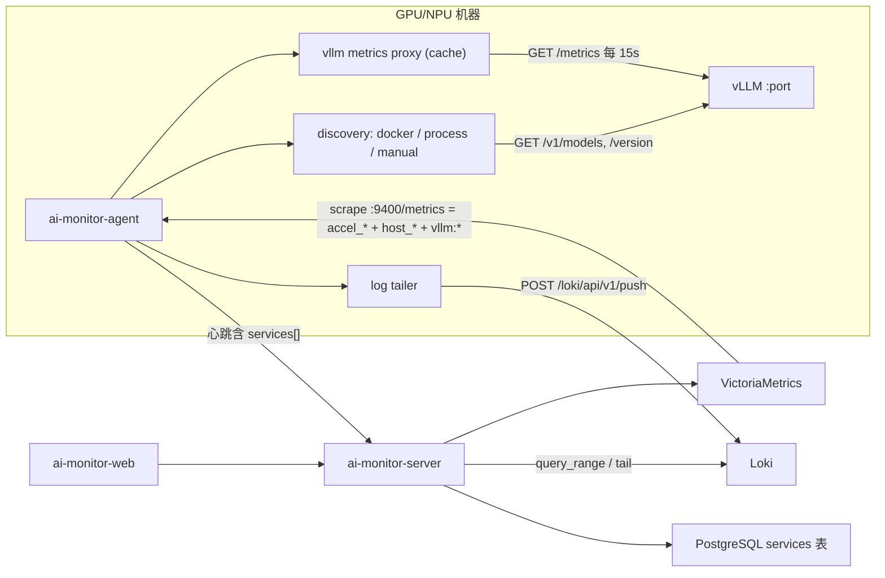

# 第二期「vLLM 监测」设计文档

日期：2026-09-04
状态：待用户审阅
上游：[2026-09-04-ai-monitor-design.md](2026-09-04-ai-monitor-design.md)（总体设计，第 5.1/5.2/5.3/6/8 节）

## 1. 目标

在第一期基础监控之上，让平台能回答「每台机器上跑着哪些 vLLM 服务、跑得怎么样、日志里发生了什么」：

- 自动发现 Docker 容器与 nohup/tmux 进程方式运行的 vLLM 服务，并支持手动登记。
- 透传每个服务的 vLLM 原生 `/metrics` 到 VictoriaMetrics，附加 `host`、`service` 标签。
- 采集服务进程信息：启动参数、环境变量（脱敏）、工作目录、启动时间、模型、vLLM 版本、端口、容器。
- 服务日志（`docker logs` 或日志文件）推送到 Loki，保留 180 天；页面提供实时 tail 与历史检索。
- Web 新增服务列表与服务详情页（指标 / 进程 / 日志），总览与机器详情加入服务信息。
- 提供无 vLLM 环境下的端到端验证手段（Agent 内置假 vLLM）。

非目标（后续期）：profile / py-spy / nsys / msprof 控制（第三期）；告警、报表、审计（第四期）；vLLM 以外的推理框架。

## 2. 已确认的决策

| 决策项 | 结论 |
| --- | --- |
| Docker 容器网络 | 两种都有：优先宿主机映射端口，否则容器 IP + 容器内端口 |
| 日志保留 | Loki 180 天（`retention_period: 4320h`） |
| 日志传输 | Agent 直接 push Loki（`/loki/api/v1/push`），server 只做查询/tail 代理 |
| 实时日志 | server 以 WebSocket 代理 Loki `/loki/api/v1/tail`，前端经 nginx 连接 `/api/logs/tail` |
| 服务身份 | 以 `(host, name)` 唯一；Docker 服务 name = 容器名，进程服务 name = 手动登记名或 `vllm-<port>` |
| 指标兼容 | PromQL 模板用 `or` 同时兼容 vLLM 新旧指标名（如 `kv_cache_usage_perc` / `gpu_cache_usage_perc`） |

## 3. 数据流



## 4. Agent 变更（`agent/`）

### 4.1 配置新增

```yaml
services:                 # 手动登记（已有）
  - name: qwen-72b
    port: 8001
    log_path: /var/log/vllm/qwen-72b.log
    profiler_dir: /data/vllm_profile/qwen-72b
discovery:
  docker: true            # 无 /var/run/docker.sock 时自动禁用
  process: true
  interval_seconds: 30
logs:
  enabled: true           # loki_url 为空时自动禁用
  batch_lines: 500
  batch_interval_seconds: 1
  buffer_max_lines: 10000
state_dir: /var/lib/ai-monitor-agent/state
```

`--fake-vllm N` CLI 参数：在进程内启动 N 个假 vLLM HTTP 服务（见 4.6），自动登记为手动服务，用于开发与端到端验证。

### 4.2 服务模型

```python
@dataclass
class ServiceInfo:
    name: str
    source: Literal["docker", "process", "manual"]
    port: int                      # 服务对外端口（宿主机视角）
    metrics_url: str               # 如 http://127.0.0.1:8001 或 http://172.17.0.5:8000
    pid: int | None
    container_id: str | None
    container_name: str | None
    log_source: Literal["docker", "file", "none"]
    log_path: str | None
    profiler_dir: str | None
    model: str | None              # /v1/models 第一个 id
    vllm_version: str | None       # /version
    started_at: float | None       # unix 秒
    cmdline: str | None
    cwd: str | None
    env: dict[str, str]            # 已脱敏
    scrape_ok: bool                # 最近一次 /metrics 抓取是否成功
```

### 4.3 发现器（`discovery/`）

- `docker.py`：通过 `docker` SDK 列出运行中容器；判定为 vLLM 的条件：`Config.Cmd + Args` 或 `Config.Entrypoint` 任一含 `vllm`，或镜像名含 `vllm`。端口：`--port` 参数 > 环境变量 `VLLM_PORT` > 8000。`metrics_url`：若该容器内端口有宿主机映射（`NetworkSettings.Ports`）用 `http://127.0.0.1:<hostport>`，否则用第一个网络的 `IPAddress` + 容器内端口；`HostConfig.NetworkMode == "host"` 时直接 `127.0.0.1:<port>`。`pid = State.Pid`，`log_source = "docker"`。socket 不存在或权限不足 → 记录一次警告并禁用。
- `process.py`：`psutil.process_iter`，命令行含 `vllm` 且含 `serve` / `api_server` / `entrypoints.openai` 之一；同一进程树只取最上层匹配进程（排除 worker 子进程）。端口：`--port` 参数 > 该 pid 的 LISTEN 套接字中最小端口 > 8000。排除已被 Docker 发现的 pid（容器进程在宿主机也可见）。`log_source = "none"`（进程方式无法获知日志位置，除非手动登记）。
- `manual.py`：来自配置 `services`，`metrics_url = http://127.0.0.1:<port>`，`log_source = "file" if log_path else "none"`；通过端口匹配到进程发现结果时补全 pid/cmdline/env。
- `registry.py`：`ServiceRegistry.refresh()` 每 `discovery.interval_seconds` 合并三源，按 `port` 去重，优先级 manual > docker > process（手动登记的 name、log_path、profiler_dir 覆盖发现结果）。首次发现或版本为空时调用 `GET /v1/models`、`GET /version`（超时 3s，失败留空下次重试）。`snapshot() -> list[ServiceInfo]`。
- `process_info.py`：`read_process_info(pid) -> (cmdline, cwd, started_at, env)`；环境变量名含 `KEY`、`TOKEN`、`SECRET`、`PASSWORD`、`PASSWD` 的值替换为 `***`；读取 `/proc/<pid>/environ` 需权限，失败则 `env = {}`。

### 4.4 指标透传（`vllm/metrics_proxy.py`）

- 后台任务每 `scrape_interval_seconds` 并发抓取所有服务 `metrics_url + /metrics`（超时 5s），结果缓存。
- `/metrics` 响应 = 现有 `accel_*`/`host_*`/`agent_*` + 缓存的 vLLM 指标。vLLM 文本用 `prometheus_client.parser.text_string_to_metric_families` 解析，只保留名称以 `vllm` 开头的 family（丢弃 `python_*`、`process_*`），每个样本追加 `host`、`service` 标签后重新序列化。
- 新增 `agent_vllm_scrape_success{host,service}` 1/0，`agent_vllm_services{host}` 服务数。
- 单个服务失败不影响其他服务与硬件指标。

### 4.5 日志采集（`logs/`）

- `tailer.py`：每个 `log_source != "none"` 的服务一个 tail 任务。Docker：`container.logs(stream=True, follow=True, since=<cursor>, timestamps=True)`，cursor 为最后一条日志时间；文件：按 inode 检测轮转，记录 offset。状态持久化到 `<state_dir>/log_cursors.json`，每 5s 落盘，重启后从 cursor 续传，不重复推送。
- `loki_client.py`：`LokiPusher.push(stream_labels, lines)`，`POST {loki_url}/loki/api/v1/push` JSON；按 `batch_lines` 或 `batch_interval_seconds` 触发；失败指数退避（1s→30s），期间缓冲不超过 `buffer_max_lines`，超出丢弃最旧并计数到 `agent_log_lines_dropped_total{service}`。
- 流标签固定三项：`host`、`service`、`source`（`docker` / `file`）。不解析日志级别（避免高基数），由 Loki 查询时用 `|=` / `|~` 过滤。
- 服务从发现结果消失后停止其 tail 任务。

### 4.6 假 vLLM（`fake/vllm.py`，仅测试/演示）

`--fake-vllm N`：在 `18000+i` 端口启动 N 个 FastAPI 应用，提供：

- `GET /metrics`：vLLM 风格文本（`vllm:num_requests_running`、`vllm:num_requests_waiting`、`vllm:kv_cache_usage_perc`、`vllm:prompt_tokens_total`、`vllm:generation_tokens_total`、`vllm:request_success_total`、`vllm:num_preemptions_total`、直方图 `vllm:time_to_first_token_seconds`、`vllm:time_per_output_token_seconds`、`vllm:e2e_request_latency_seconds`，带 `model_name` 标签），数值随时间随机游走。
- `GET /v1/models` → `{"data":[{"id":"fake/Qwen2.5-7B-Instruct"}]}`；`GET /version` → `{"version":"0.11.0-fake"}`。
- 每秒向 `<state_dir>/fake-vllm-<i>.log` 追加一行 INFO 日志（模拟 `Avg prompt throughput ...`），偶发 WARNING。

自动登记为手动服务 `fake-vllm-<i>`，`log_path` 指向上述文件。

### 4.7 心跳载荷

`services` 由空列表变为 `ServiceInfo` 列表（`asdict`）。字段与 4.2 一致，`env` 已脱敏；单服务 cmdline+env 通常数 KB，可接受。

## 5. Server 变更（`server/`）

### 5.1 数据表

```
services(
  id, agent_id FK agents.id ON DELETE CASCADE,
  name, source, port, metrics_url,
  pid, container_id, container_name,
  log_source, log_path, profiler_dir,
  model, vllm_version, started_at (timestamptz null),
  cmdline (text null), cwd, env_json (json), scrape_ok (bool),
  active (bool, default true), first_seen_at, last_seen_at,
  UNIQUE (agent_id, name)
)
```

Alembic 迁移 `0002_services`。

### 5.2 心跳处理

`POST /api/agents/heartbeat` 解析 `services`（Pydantic `ServiceIn`，与 4.2 字段一致，未知字段忽略），对该 agent：存在同名记录则更新全部字段并 `active=true, last_seen_at=now`；否则插入；本次未出现的记录标记 `active=false`（保留历史，便于第三期产物关联）。

### 5.3 API

- `GET /api/services?active=true|false|all`（默认 `true`）→ `ServiceOut[]`：`{id, agent_id, host, name, source, port, metrics_url, pid, container_name, model, vllm_version, started_at, log_source, scrape_ok, active, last_seen_at, status}`。`status`：agent 离线 → `unknown`；`active=false` → `stopped`；`scrape_ok=false` → `degraded`；否则 `running`。
- `GET /api/services/{id}` → `ServiceDetail = ServiceOut + {cmdline, cwd, env, container_id, log_path, profiler_dir, first_seen_at}`。
- `GET /api/agents/{id}/services` → 该机器的 `ServiceOut[]`。
- `GET /api/logs/query?host=&service=&start=&end=&q=&limit=500&direction=backward` → 构造 LogQL `{host="<host>",service="<service>"}`，`q` 非空时追加 ` |= "<q>"`（转义 `"` 与 `\`）；代理 Loki `/loki/api/v1/query_range`；返回 `{"lines":[{"ts": "<RFC3339Nano>", "line": "..."}], "has_more": bool}`（按时间正序）。`limit` 上限 5000。
- `WS /api/logs/tail?host=&service=&q=&token=<access JWT>`：校验 JWT 后连接 Loki `ws://loki:3100/loki/api/v1/tail?query=...&delay_for=0&limit=100&start=<now-1m ns>`，把每条 `streams[].values` 转成 `{"ts","line"}` JSON 逐条转发；任一端断开即关闭另一端。JWT 放 query 参数是因为浏览器 WebSocket 无法设置 Header。
- 指标模板新增（params：`host`、`service`，部分含 `window`，白名单 `^[0-9]+[smh]$`，默认 `1m`）：

| name | expr |
| --- | --- |
| vllm_running | `vllm:num_requests_running{host="$host",service="$service"}` |
| vllm_waiting | `vllm:num_requests_waiting{host="$host",service="$service"}` |
| vllm_kv_cache_perc | `(vllm:kv_cache_usage_perc{...} or vllm:gpu_cache_usage_perc{...}) * 100` |
| vllm_prompt_tokens_rate | `sum(rate(vllm:prompt_tokens_total{...}[$window]))` |
| vllm_generation_tokens_rate | `sum(rate(vllm:generation_tokens_total{...}[$window]))` |
| vllm_request_rate | `sum(rate(vllm:request_success_total{...}[$window]))` |
| vllm_preemption_rate | `sum(rate(vllm:num_preemptions_total{...}[$window]))` |
| vllm_ttft_quantiles | `label_replace(histogram_quantile(0.5, sum by (le) (rate(vllm:time_to_first_token_seconds_bucket{...}[$window]))), "q","p50","","") or label_replace(histogram_quantile(0.9, ...),"q","p90","","") or label_replace(histogram_quantile(0.99, ...),"q","p99","","")` |
| vllm_tpot_quantiles | 同上，指标 `vllm:time_per_output_token_seconds_bucket or vllm:inter_token_latency_seconds_bucket` |
| vllm_e2e_quantiles | 同上，指标 `vllm:e2e_request_latency_seconds_bucket` |
| vllm_scrape_ok | `agent_vllm_scrape_success{host="$host",service="$service"}` |
| cluster_vllm_running_by_service | `sum by (host, service) (vllm:num_requests_running)` |
| cluster_vllm_waiting_by_service | `sum by (host, service) (vllm:num_requests_waiting)` |

`{...}` 均为 `{host="$host",service="$service"}`。路由允许参数扩展为 `host`、`index`、`service`、`window`。

- `LokiClient(base_url)`：`async query_range(query, start_ns, end_ns, limit, direction)`；错误 → `LokiError` → 502。

## 6. Web 变更（`web/`）

- 导航新增「服务」`/services`。
- `ServicesPage`：表格（服务名、机器、模型、vLLM 版本、端口、来源 Tag、状态 Tag（running 绿 / degraded 橙 / stopped 灰 / unknown 红）、当前 running/waiting（来自 `cluster_vllm_running_by_service` / `cluster_vllm_waiting_by_service` 即时查询）、最后心跳），搜索框按名称/机器/模型过滤，`active` 开关显示已停止服务。
- `ServiceDetailPage` `/services/:id`：顶部 Descriptions（机器、模型、版本、端口、来源、容器、PID、启动时间、状态）。Tabs：
  - 指标：请求（running / waiting 双线）、Token 吞吐（prompt / generation tokens/s）、TTFT p50/p90/p99、TPOT p50/p90/p99、E2E p50/p90/p99、KV cache 使用率、抢占速率。`window` 由时间范围推导：range ≤ 6h 用 `1m`，≤ 7d 用 `5m`，否则 `30m`。
  - 进程：启动命令（可复制）、工作目录、环境变量表（脱敏后）、日志来源与路径、profiler 目录。
  - 日志：顶部「实时」开关与关键词输入；实时开启时通过 WebSocket 追加显示（最多保留 2000 行，自动滚动可暂停）；关闭时按全局时间范围调用 `/api/logs/query`（默认 500 行，「加载更早」按钮翻页）。等宽字体，WARNING/ERROR 关键字高亮。
- `OverviewPage`：新增「vLLM 服务」卡片（running 数 / 总数）与服务表（前 10 个按 waiting 降序），点击进详情。
- `HostDetailPage`：新增「服务」表格（该机器服务）。
- `api/services.ts`、`api/logs.ts`（含 `openLogTail(host, service, q, onLine)` 基于 `WebSocket`，URL 用当前页面协议推导 `ws/wss`）。

## 7. 部署变更（`deploy/`）

- `loki/config.yml`：`retention_period: 4320h`。
- `docker-compose.yml`：fake Agent 增加 `--fake-vllm 2`（nvidia）与 `--fake-vllm 1`（ascend），环境变量 `AI_MONITOR_LOKI_URL=http://loki:3100`；挂载匿名卷到 `/var/lib/ai-monitor-agent`。
- `install-agent.sh`：写入配置时加入 `loki_url`（`--loki` 参数，缺省与 server 同主机 `:3100`）与 `discovery` / `logs` 默认段；Docker 模式保持 `--net=host --pid=host` 并挂载 `/var/run/docker.sock`（已有）；文件日志需额外 `-v <日志目录>:<日志目录>:ro`，脚本新增 `--log-dir` 可重复参数。
- `agent.example.yaml` 同步新增段。

## 8. 安全

- 环境变量脱敏在 Agent 侧完成，server 不接触明文。
- WebSocket tail 的 JWT 只接受 access token；过期即拒绝连接（4401）。
- LogQL 由 server 拼接，`host`/`service` 只允许 `^[A-Za-z0-9_.-]+$`，关键词做字符串转义后置于 `|= "..."`，不允许用户传原始 LogQL。

## 9. 错误处理与降级

- Docker socket 不可用 → Docker 发现禁用，进程与手动发现照常。
- vLLM `/metrics` 超时或非 200 → `agent_vllm_scrape_success=0`，其余透传不受影响；`/v1/models` 失败 → model 留空、下次重试。
- Loki 不可达 → Agent 缓冲 + 退避；server 日志接口返回 502，前端显示错误态；tail 断开前端自动重连（最多 5 次，间隔 2s）。
- 服务消失 → `active=false`，页面显示 `stopped`，历史日志与指标仍可查。
- 假 vLLM 只在 `--fake-vllm` 下加载，不进入生产路径。

## 10. 测试

- Agent：Docker 发现用 fake `docker` 客户端对象（列出预构造容器 attrs：host 网络 / 端口映射 / 仅容器 IP 三种）；进程发现用 fake `psutil` 进程列表与连接；registry 合并优先级；metrics_proxy 用 respx 模拟两个服务（一个 500）并断言透传文本含 `host`/`service` 标签、过滤掉 `python_*`；tailer 用临时文件模拟追加与轮转、cursor 持久化；LokiPusher 用 respx 断言批量与退避、丢弃计数。
- Server：心跳 upsert 与 `active` 翻转；services API 状态计算四态；logs query 的 LogQL 构造与转义；tail WS 用假 Loki WS 服务端（`websockets` 库起临时 server）验证转发与鉴权失败；新模板渲染与 `window` 校验。
- Web：`window` 推导与 LogQL 参数构造单元测试；日志视图行数上限与高亮的组件测试。
- 端到端：compose `--profile fake`（含 `--fake-vllm`），验证：`GET /api/services` 出现 3 个 `running` 服务；VM 中 `count(vllm:num_requests_running)` = 3；`GET /api/logs/query` 返回假日志；Playwright 打开服务详情，指标图有数据、日志 Tab 实时出现新行。
